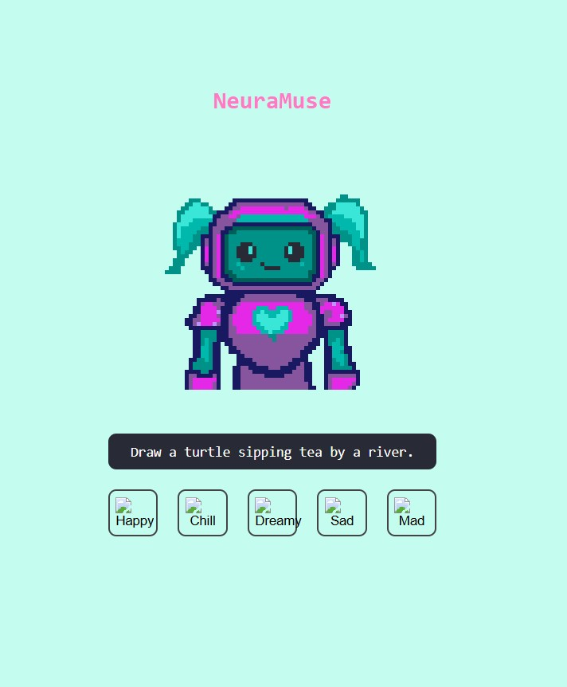

---

## How to Use

1. Clone or download the repo.
2. Open `index.html` in your browser.
3. View the centered Musea character.
4. Click a mood button to get a drawing prompt.
5. Use the prompt to create your own art!

---

## Customization Options

- Change or add moods by editing the mood button section in `index.html`.
- Add your own Musea sprites by replacing `musea.png`.
- Update prompt logic inside `script.js`.

---

## Styling Highlights

The app uses the following CSS techniques:
- `display: flex` with `justify-content: center` and `align-items: center` to center everything on screen
- `image-rendering: pixelated` for crisp pixel art visuals
- Responsive container with a max width for better layout
- Retro-themed font from Google Fonts

---

## To-Do / Future Ideas

- [ ] Add more moods and related prompts
- [ ] Animate Musea reactions
- [ ] Allow users to save prompts or mark favorites
- [ ] Add sound effects or ambient music
- [ ] Create a mobile-first layout

---

## Credits

- Pixel art by Phoenix Kargbo
- Font: [Press Start 2P](https://fonts.google.com/specimen/Press+Start+2P) via Google Fonts

---

## Preview

---

